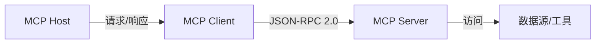
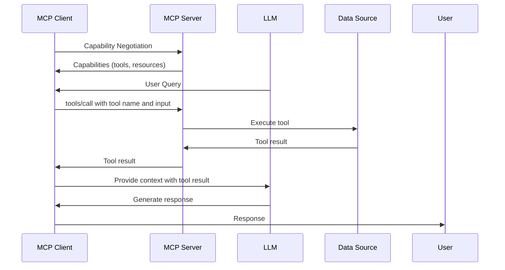

## 1. 简介 (Introduction)

### 由来

1. LLM如何实现精准计算？
    1. 调用API
    2. 调用工具
2. LLM如何获得结构化数据？
    1. Function call

**MCP (Model Context Protocol)** 是一种由 Anthropic 推出的开放协议，旨在为大型语言模型 (LLMs) 提供标准化的上下文信息格式和外部数据/工具集成方式。它通过定义清晰的接口和数据结构，解决了当前 LLM 生态系统中的两大关键问题：

- **上下文碎片化** ：不同 LLM 提供商、工具和应用往往采用各自的上下文格式，导致互操作性差。MCP 的目标是成为 LLM 领域的“USB-C”，提供统一的连接标准。
    - 同样的工具/API被不同人使用需要各自实现Prompt集成，无论是对工具/API的理解还是执行效果差异很大。
- **集成复杂性** ：传统上，将 LLM 与新的数据源或工具集成需要大量定制开发，形成系统孤岛，难以扩展。
    - 某些项目会通过创建工具集合+特定Prompt的方式提供给自己的LLM，添加或者修改工具集往往牵一发而动全身。

MCP 的核心目标是创建一个通用的“上下文语言”，使 LLM、应用程序和用户能够更高效地沟通与协作。它让 LLM 应用能够轻松连接外部数据源（如文件、数据库）和工具（如 API 调用、脚本执行），从而提升响应的准确性和实用性。

### 关键要点

- MCP 是一个开放标准，帮助 AI 助手无缝集成外部数据源和工具，提升响应的上下文相关性。
- 采用客户端-服务器架构，基于 **JSON-RPC 2.0**，支持资源 (Resources)、工具 (Tools)、提示 (Prompts)、采样 (Sampling) 和通知 (Notifications) 等功能。
- 解决 AI 与数据孤岛的连接问题，简化开发和集成流程。

---

## 2. 核心概念 (Core Concepts)

MCP 的核心在于标准化的数据结构和接口，用于表示和管理 LLM 的上下文以及与外部系统的交互。以下是关键概念的详细说明：

- Context (上下文)：LLM 在生成响应时依赖的所有信息，例如用户输入、历史对话或外部数据。
- Context Item (上下文项)：上下文的最小单元，包含键值对 (key-value pair) 和可选的元数据 (metadata)。例如，用户信息或文件内容。
- Context Group (上下文组)：一组相关上下文项，可嵌套组织，适用于复杂场景。
- Context Scope (上下文作用域)：定义上下文的有效范围，例如会话级或全局级。
- Context Manifest (上下文清单)：描述完整上下文的结构化文档。
- Context Provider (上下文提供者)：提供上下文数据的来源，如数据库或文件系统。
- Context Consumer (上下文消费者)：使用上下文的实体，通常是 LLM。
- MCP Host (主机)：运行 LLM 的核心应用程序。
- MCP Client (客户端)：连接主机与服务器的中介，负责通信。
- MCP Server (服务器)：暴露数据和工具的轻量级程序，供客户端调用。
- Resources (资源)：提供上下文数据，如文件内容或数据库记录。
- Tools (工具)：扩展 LLM 能力的功能，例如执行脚本或调用外部 API。
- Prompts (提示)：预定义的指令模板，用于引导 LLM 生成特定输出。
- Sampling (采样)：允许服务器请求 LLM 生成文本。
- Notifications (通知)：服务器向客户端发送的异步消息。

MCP servers can provide three main types of capabilities:

1. Resources: File-like data that can be read by clients (like API responses or file contents)
2. Tools: Functions that can be called by the LLM (with user approval)
3. Prompts: Pre-written templates that help users accomplish specific tasks

这些概念共同构成了 MCP 的基础，确保上下文和工具的标准化管理。

---

## 3. MCP 工作原理与架构 (Workflow and Architecture)

MCP 采用 **客户端-服务器架构**，通过 **JSON-RPC 2.0** 实现通信。以下是其工作原理和架构的详细说明：

### 3.1 架构概述

- **服务器** ：提供数据源、工具和提示模板，并声明其支持的功能。
- **客户端** ：AI 应用通过客户端连接服务器，请求资源或调用工具。
- **通信协议** ：基于 JSON-RPC 2.0，初始化时双方协商能力 (capabilities)。

### 3.2 工作流程

1. **能力协商 (Capability Negotiation)**：客户端和服务器声明各自支持的功能，例如资源提供或工具调用。

2.**请求传输 (Request Transmission)**：通过 JSON-RPC 2.0 发送请求（如获取资源或调用工具）。

3. **执行 (Execution)**：LLM 或服务器处理请求并返回结果。

4. **双向通信**：支持采样 (Sampling) 和通知 (Notifications) 等功能，实现灵活交互。

### 3.3 技术架构细节

- **MCP 主机 (Host)**：运行 LLM 的应用程序，是整个系统的核心。
- **MCP 客户端 (Client)**：连接主机和服务器的中介，负责请求转发。
- **MCP 服务器（Server）**:通过标准MCP协议提供服务的轻量程序或服务。
- **通信流程**


暂时无法在飞书文档外展示此内容

- MCP使用**JSON-RPC 2.0**作为标准化的通信协议，确保请求和响应的格式一致。其通信方式包括：
    - **请求（Requests）**：客户端向服务器发送操作指令，例如获取资源或调用工具。
    - **响应（Responses）**：服务器处理请求后返回结果。
    - **通知（Notifications）**：无需响应的单向消息，用于异步通信。
- **能力协商（Capability Negotiation)**: 在通信初始化阶段，客户端和服务器会交换各自支持的功能，以确保双方了解对方的能力范围：
    - **服务器能力**：如提供资源、工具、提示，或支持采样请求。
    - **客户端能力**：如支持通知、采样，或特定的数据处理方式。
- **资源（Resources）**:资源是服务器提供的数据源，例如文件、数据库记录或其他静态内容。
    - 客户端可以通过以下方法与资源交互：
        - resources/list：获取可用资源列表。
        - resources/get：获取特定资源的内容。
    - **示例**：客户端请求服务器提供用户配置文件或项目文档，供LLM分析。
- **工具（Tools）**:工具是服务器提供的可执行操作，例如API调用或脚本执行。
    - 客户端可以通过以下方法与工具交互：
        - tools/list：获取可用工具列表。
        - tools/call：执行特定工具并获取结果。
- **提示（Prompts）**:提示是服务器提供的预定义指令模板，用于引导LLM生成特定类型的输出。
    - 客户端可以请求提示模板，并将其作为输入传递给LLM。
    - **示例**：使用代码审查提示模板，让LLM生成针对代码的反馈
- **采样（Sampling）**:采样允许服务器通过客户端请求LLM生成文本。
    - 服务器发送采样请求，客户端调用LLM生成结果并返回。
    - **示例**：服务器请求LLM根据资源内容生成摘要或建议。
- **通知（Notifications）**:通知是服务器向客户端发送的异步消息，无需响应。
    - 用于更新状态或触发事件。
    - **示例**：服务器通知客户端某个数据源已更新，提示LLM重新加载数据。

### 3.4 工作原理

1. Protocol Layer（协议层）

**协议层** 是 MCP 架构的核心，负责定义通信消息的格式、请求与响应的关联以及高级通信模式。它基于 **JSON-RPC 2.0** 协议，确保客户端与服务器之间的通信既标准化又高效。

- **消息格式**：协议层规定了所有消息的结构，包括请求、响应和通知。每个消息都遵循 JSON-RPC 2.0 的字段要求，例如 jsonrpc（协议版本）、id（请求标识符）、method（调用的方法）和 params（参数）。
- **请求/响应链接**：通过 id 字段，协议层确保每个请求都能与对应的响应正确匹配，避免通信混乱。
- **通信模式**：支持同步和异步通信。例如，客户端可以通过采样（Sampling）请求 LLM 生成文本，实现双向交互。

协议层的标准化设计赋予了 MCP 强大的扩展性和兼容性，使其能够适应不同的应用场景，同时与现有技术无缝衔接。

2. Transport Layer（传输层）

**传输层** 负责在客户端和服务器之间实际传输数据。MCP 的传输层设计灵活，支持多种协议，以满足不同的部署需求和性能要求。

- **HTTP**：支持 RESTful 风格的请求-响应模式，易于实现和广泛部署。
    - 使用 Server-Sent Events 实现 server-to-client 通信
    - 使用HTTP POST 实现 client-to-server 通信
- **Stdio（标准输入输出）**：用于本地进程间通信，常用于开发或测试环境。

传输层的多样性和安全性设计使 MCP 能够轻松集成到各种系统架构中，满足不同场景下的通信需求。

3. 消息类型（Message Types）

MCP 定义了三种主要 **消息类型**，以支持多样化的通信需求。以下是它们的详细说明和示例：

### (1) 请求（Requests）

客户端向服务器发送的指令，期望获得响应。例如，获取资源或调用工具。

```
{
  "jsonrpc": "2.0",
  "id": 1,
  "method": "resources/get",
  "params": {"uri": "file:///example.txt"}
}

```

### (2) 响应（Responses）

服务器对请求的回复，包含执行结果或错误信息。

```
{
  "jsonrpc": "2.0",
  "id": 1,
  "result": {"content": "This is the content of example.txt"}
}

```

### (3) 通知（Notifications）

单向消息，无需响应，通常用于异步事件或状态更新。

```
{
  "jsonrpc": "2.0",
  "method": "notifications/update",
  "params": {"message": "Resource updated"}
}

```

这些消息类型确保了 MCP 能够处理从简单请求到复杂异步交互的各种场景，同时保持通信的高效性和简洁性。

4. Connection Lifecycle（连接生命周期）

**连接生命周期** 管理客户端与服务器之间的连接过程，确保通信的可靠性和安全性。它包括以下几个关键阶段：

### (1) 连接建立


- **过程**：客户端通过选定的传输协议与服务器建立连接。
- **后续步骤**：连接成功后，进入能力协商阶段。

### (2) 能力协商（Capability Negotiation）

- **定义**：客户端和服务器交换各自支持的功能，例如资源提供、工具调用或采样。
- **作用**：协商结果确定了后续通信中可用的功能集合。

### (3) 会话管理

- **特点**：连接期间，双方维护一个状态会话，跟踪请求和响应的状态。
- **优势**：支持长连接，允许多次请求在同一连接中执行，提升效率。

### (4) 连接关闭

- **过程**：客户端或服务器主动关闭连接，结束会话。
- **清理**：关闭前可执行资源释放或状态保存等操作。

### 3.5 架构图




---

## 4. MCP 数据格式 (Data Format) 与 Schema 定义

MCP 使用 **JSON** 作为主要数据格式，并通过 TypeScript Schema 文件定义规范，确保一致性和可扩展性。

### 4.1 示例

- **Context Item 示例**

```
{
    "key": "user_name",
    "value": "Alice",
    "metadata": {
      "source": "user_profile"
    }
  }

```

*说明* ：表示一个上下文项，包含键、值和元数据，用于描述用户信息。

- **工具定义示例**

```
{
    "name": "get_weather",
    "description": "Get weather",
    "inputSchema": {
      "type": "object",
      "properties": {
        "latitude": {"type": "number"}
      }
    }
  }

```

*说明* ：定义一个获取天气的工具，指定输入参数的格式。

### 4.2 Schema 定义 (TypeScript)

以下是部分核心接口的 TypeScript 定义：

```
interface Request {
  jsonrpc: "2.0";
  id: number | string;
  method: string;
  params?: any;
}

interface Response {
  jsonrpc: "2.0";
  id: number | string;
  result?: any;
  error?: {
    code: number;
    message: string;
    data?: any;
  };
}

interface ToolDefinition {
  name: string;
  description?: string;
  inputSchema: JSONSchema;
}

interface Resource {
  uri: string;
  type: "text" | "binary";
  content: string;
  metadata?: { [key: string]: any };
}

```

*说明*：这些接口定义了请求、响应、工具和资源的结构，确保通信的规范性。

---

## 5. MCP 的优势 (Benefits)

MCP 提供了以下显著优势：

- 互操作性 (Interoperability)：标准化格式，促进不同系统间协作。
- 透明度 (Transparency)：用户可清晰了解 LLM 如何使用上下文。
- 可移植性 (Portability)：上下文可在不同系统间轻松迁移。
- 可扩展性 (Extensibility)：支持添加新的上下文项、资源和工具。
- 可重用性 (Reusability)：上下文可被多个应用共享和重用。
- 可调试性 (Debuggability)：清晰的上下文表示，便于排查问题。
- 灵活性：提供精细的上下文控制，适应多样化需求。
- 性能：优化通信流程，降低延迟。

---

## 6. MCP 的应用场景 (Use Cases)

MCP 的灵活性使其适用于多种场景：

- 对话式 AI：构建智能聊天机器人，集成用户数据和知识库。
- 内容生成：生成文本、代码或创意内容。
- 数据分析：结合上下文数据进行智能分析。
- 知识管理：构建和管理企业知识库。
- AI 驱动的 IDE：实现代码补全、调试和自动化。
- 聊天界面：整合客户数据和知识库，提升服务质量。
- 自定义 AI 工作流：连接特定数据源，满足业务需求。

---

## 7. MCP Capabilities 对比

以下表格对比了客户端和服务器支持的功能：

| **功能** | **描述** | **客户端支持** | **服务器支持** |
| --- | --- | --- | --- |
| Resources | 提供上下文数据 | ❌ | ✅ |
| Tools | 执行操作 | ❌ | ✅ |
| Prompts | 提供提示模板 | ❌ | ✅ |
| Sampling | 请求 LLM 生成文本 | ✅ | ❌ |
| Notifications | 发送异步消息 | ✅ | ✅ |

*说明*：服务器负责提供资源和工具，客户端则支持采样和接收通知。

---

## 8. 工具功能的实现 (Tool Implementation)

### 8.1 实现步骤

- **工具发现** ：客户端通过 `tools/list` 方法获取服务器支持的工具列表。
- **工具调用** ：通过 `tools/call` 方法执行特定工具。

### 8.2 请求示例

```
{
  "jsonrpc": "2.0",
  "id": 2,
  "method": "tools/call",
  "params": {
    "name": "get_weather",
    "input": {"latitude": 37.7749}
  }
}

```

*说明*：客户端请求调用 `get_weather` 工具，传入纬度参数。

### 8.3 安全性考虑

- **输入验证** ：使用 `inputSchema` 确保参数格式正确。
- **人类审核** ：建议在敏感操作前加入人工确认步骤。
- **权限控制** ：服务器需实现访问控制，防止未经授权的调用。

---

## 9. 开发 MCP 应用 (Developing MCP Applications)

### 9.1 开发服务器

1. 选择 SDK：推荐使用 Python 或 TypeScript。

2. 定义能力：实现 `get_capabilities()` 方法，声明支持的功能。

3. 处理请求：实现工具执行和资源提供的逻辑。

4. 运行服务器：启动服务并暴露端点。

5. 能力声明示例：

```
{
     "resources": [{"name": "file_list", "description": "List files"}],
     "tools": [{"name": "run_script", "description": "Execute script"}],
     "prompts": [{"name": "code_review", "template": "Review: {code}"}]
   }

```

### 9.2 开发客户端

1. 连接服务器：指定服务器端点，初始化 JSON-RPC 连接。

2. 请求功能：调用 `tools/call` 或 `resources/list` 获取数据。

3. 集成 LLM：将返回数据作为上下文输入 LLM。

4. 声明能力：定义客户端支持的功能，如采样。

### 9.3 最佳实践

- 模块化：将工具和资源逻辑分离，便于维护。
- 异步处理：使用异步 I/O 提升性能。
- 错误处理：提供清晰的错误码和消息，应对异常情况。
- 文档化：为暴露的能力提供详细文档。
- 性能优化：支持多客户端请求，使用缓存机制。
- 环境变量管理：
    - 使用 `.env` 文件存储敏感信息（如 API 密钥）。
    
    ```
    from dotenv import load_dotenv
        load_dotenv()
    
    ```
    
    - **注意事项** ：确保工作目录正确，或显式指定 `.env` 文件路径。

---

## 10. 社区与资源 (Community and Resources)

MCP 是一个开源项目，社区支持不断发展。以下是相关资源：

- **Smithery.ai**：https://smithery.ai/ - 提供工具、示例和讨论平台。
- **官方MCP Server**: https://modelcontextprotocol.io/examples
- **Anthropic 官方文档**：https://modelcontextprotocol.io/ - 详细规范和 API 参考。
- **GitHub 仓库**：https://github.com/modelcontext - 包含代码和 SDK。
- **MCP全量提示词**： https://modelcontextprotocol.io/llms-full.txt
- **其他**：https://x.com/AtomSilverman/status/1897409286466363626

---

## 总结 (Conclusion)

MCP 是一种前瞻性的协议，通过标准化上下文管理和外部集成，解决了 LLM 生态系统中的核心挑战。它提升了互操作性、透明度、可移植性和可扩展性，为开发更智能的 LLM 应用奠定了坚实基础。

---

### 补充资料

- **MCP 规范**：https://modelcontextprotocol.io/
- **JSON-RPC 2.0**：https://www.jsonrpc.org/specification