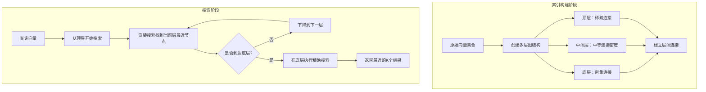

在人工智能应用的浪潮中，无论是推荐系统、聊天机器人、RAG（检索增强生成）管道，还是异常检测系统，向量搜索已经成为不可或缺的核心技术。与传统的精确关键词匹配不同，向量搜索的革命性在于其能够基于语义含义进行信息检索，这标志着我们从字面匹配时代迈向了智能理解时代。

# **向量搜索的核心原理**

向量搜索的基本理念可以用一个简洁的公式表达：**语义相似性 = 向量邻近性**。每个数据项都被嵌入到一个稠密的高维数值向量中，这个向量捕获了其语义含义。当执行搜索时，查询同样被转换为向量，系统通过数学计算找到与查询向量最接近的项目。

以一个具体示例来说明：假设我们有三个文档的嵌入向量：

- iPhone文档：[0.85, 0.12, 0.71]
- Galaxy文档：[0.89, 0.14, 0.73]
- 食谱文档：[0.12, 0.91, 0.15]

当查询向量为[0.90, 0.13, 0.76]时，通过欧几里得距离或余弦相似度计算，iPhone和Galaxy文档明显比食谱文档更接近查询向量。

# **五种搜索方法**

## 1. 暴力搜索：最笨但最准确的方法

这就像你在图书馆找一本书，决定把每一本书都翻一遍。听起来很蠢，但绝对不会漏掉任何一本相关的书。

**什么时候用？** 当你的数据不多（比如几千到几万条记录），并且需要100%准确的结果时。

在很多项目的早期阶段，我们往往高估了数据量。与其一开始就上复杂的方案，不如先用暴力搜索跑起来，等真的有性能问题再优化。这样既省时间，又避免了过度设计。

## 2. IVF（倒排文件索引）：聪明的分区策略

想象你在管理一个超大的图书馆，你会怎么做？当然是按类别分区！科技类放一起，文学类放一起，需要找书的时候直接去对应的区域。

IVF就是这个思路：先把所有向量按相似性分成若干组，搜索时只在最相关的几个组里找。

**核心参数简化理解：**
    - **nlist**：分多少个组（组太少效果不好，组太多又变复杂了）
    - **nprobe**：搜索时看几个组（看得越多越准确，但也越慢）

1. **索引构建过程**：
    - 使用K-means算法将向量空间划分为nlist个聚类
    - 每个聚类有一个质心（centroid）
    - 每个向量被分配到最近的质心所在的聚类
    - 为每个聚类创建一个倒排列表，存储属于该聚类的所有向量
2. **搜索过程**：
    - 计算查询向量与所有质心的距离
    - 选择距离最近的nprobe个质心
    - 只在这些质心对应的倒排列表中搜索
    - 计算查询向量与列表中所有向量的距离
    - 返回距离最近的K个结果

这种方法特别适合那种"八成准确就够用"的场景。比如推荐系统，用户不会察觉到第8名和第9名的微小差异。

## 3. HNSW：像GPS导航一样智能

这是我个人最喜欢的方法，因为它的思路特别巧妙。想象一下GPS是怎么工作的：先从高速公路层面规划大致路线，然后逐步精确到街道、小巷。

HNSW把向量组织成多层网络：

- **顶层**：粗略的"高速公路"，帮你快速接近目标区域
- **底层**：详细的"街道地图"，精确定位最终答案

1. **索引构建过程**：
    - 创建多层图结构，顶层节点最少，底层包含所有节点
    - 每个节点随机分配到不同层级（层级服从几何分布）
    - 每层内部，节点与其最近的M个邻居建立连接
    - 新节点插入时，从顶层开始，通过贪婪搜索找到每层最近的节点
    - 与最近的节点建立双向连接，同时维护每个节点最多M个连接
2. **搜索过程**：
    - 从顶层开始搜索
    - 在当前层使用贪婪算法找到局部最近点
    - 使用这些点作为入口点下降到下一层
    - 在每一层保持ef个候选点
    - 到达底层后，返回最近的K个结果

**为什么它这么受欢迎？** 在我看来，HNSW成功的原因是它模仿了人类的思维模式。我们解决问题时也是先有个大概方向，然后逐步细化。这种"由粗到细"的策略在AI领域屡试不爽。

## 4. PQ（乘积量化）：压缩存储的艺术

当数据量大到内存放不下怎么办？PQ给出了一个优雅的解决方案：既然存不下原图，那就存缩略图。

**打个比方：** 你手机里存了一万张照片，如果每张都是高清原图，内存肯定不够。但如果存成缩略图，虽然细节少了点，但该认出的还是能认出来。

1. **训练过程**：
    - 将D维向量空间分割为M个子空间，每个子空间维度为D/M
    - 对每个子空间执行K-means聚类，生成ksub个聚类中心
    - 这些聚类中心形成码本（codebook）
2. **编码过程**：
    - 将输入向量分割为M个子向量
    - 每个子向量与对应子空间的码本比较，找到最近的码字
    - 存储码字的索引（通常为8位整数）而非原始向量
    - M个索引组成PQ码，总共需要M字节存储
3. **搜索过程**：
    - 查询向量同样分割为M个子向量
    - 预计算查询子向量与各子空间码本的距离表
    - 使用查找表快速计算查询向量与数据库中PQ码的近似距离
    - 返回距离最近的K个结果

**适用场景分析：** 这种方法特别适合那种"量大于质"的应用。比如电商平台的商品推荐，有几千万商品，哪怕准确度稍微低一点，用户也不会感觉到明显差异。

## 5. 混合搜索：取长补短的组合拳

现实世界的问题往往很复杂，单一方法很难完美解决。混合搜索就像组装一台电脑，选最适合的配件组合。

**典型的组合策略：**

- 先用IVF快速过滤大范围
- 再用HNSW精确导航
- 最后用暴力搜索确保前几名的准确性

**我的实践体会：** 在实际项目中，混合方法往往是最稳妥的选择。虽然实现复杂一些，但能适应不同的查询场景，用户体验更稳定。

## 怎么选择？一个简单的决策树

## 按数据量选择

- **1万以下**：直接暴力搜索，简单粗暴
- **1万到100万**：IVF，性价比最高
- **100万到1000万**：HNSW，性能和准确性的最佳平衡
- **1000万以上**：考虑PQ或混合方案

## 按业务需求选择

**追求绝对准确**（比如医疗诊断、金融风控）：暴力搜索或HNSW

**追求响应速度**（比如实时推荐）：HNSW

**存储成本敏感**（比如大规模文档搜索）：PQ

**需求复杂多变**（比如综合搜索引擎）：混合方案